# Health Survey Data Analysis of BMI using GridDB

**Introduction:**

BMI (Body mass index) is a ratio of body mass to height, used as a
health indicator among many fitness trainers and health professionals. A
person is classified into different categories, normal, overweight,
obese, and extremely obese, according to their gender and BMI.

We will be using National Health and Nutrition Examination Survey
(NHANES) data to relative different health indicators with BMI.
The [National Health and Nutrition Examination Survey
(NHANES)](https://www.cdc.gov/nchs/nhanes/index.htm) data is a complex
survey of tens of thousands of people designed to assess the health and
nutritional status of adults and children in the United States. The
NHANES data includes many measurements related to overall health,
physical activity, diet, psychological health, socioeconomic factors,
and more.

**Exporting and Import dataset using GridDB:**

We will be using GridDB to store a large amount of preprocessed data
from NHANES. GridDB is a highly scalable and in-memory No SQL database
that allows parallel processing for higher performance and efficiency.
It is optimized for time-series databases for IoT and big data
technologies. Using GridDB’s python client, we would be able to import
or export data in real-time.

*Setup GridDB*:

First and foremost, we need to make sure that we have properly installed
GridDB on our system. You can find the step-by-step guide to set up
GridDB on different operating systems using this
[link](https://griddb.net/en/blog/griddb-quickstart/).

*Dataset:*

NHANES has their built-in libraries available on python as well as R. we
would be able to use the data by installing the NHANES library by
running the following command on python or anaconda command prompt.

Next, you can import the library and save the data into any variable; in
this case, “data\_df”. 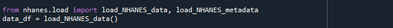

Along with the NHANES library, we would be using Pandas, Matplotlib, and
Seaborn library to analyze and visualize the dataset.

*Data Preprocessing:*

NHANES dataset contains around 200 variables, containing information
about diet and health conditions of the person. To make our analysis
easier to understand and concentrated on conditions affecting BMI, we
will filter out some columns that seem to be more important.

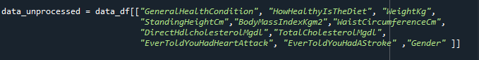

Lastly, we would drop the NULL columns and introduce the primary key
column into our dataset:

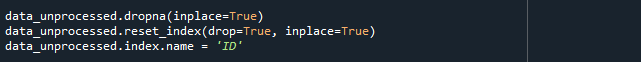

To keep a local copy of the data, we can save it as a CSV file on our
system before exporting it on GridDB.

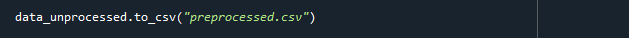

*Uploading the data to GridDB:*

The standard approach set by GridDB to insert data is to create a
container and use the put methods.

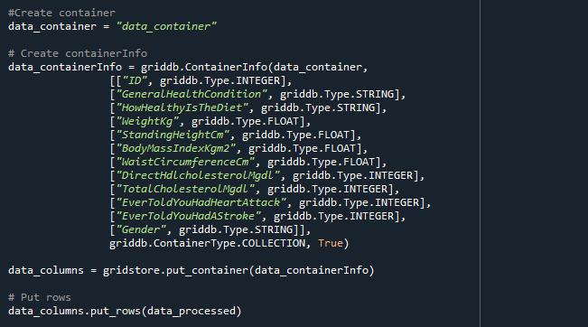

We have successfully exported the data to the GridDB cloud without any
errors and can now access the data from anywhere using the GridDB
interface.

*Accessing Data from GridDB:*

To access the data from the GridDB cloud, we need to query out the
database using TQL, GridDB’s query language. TQL uses similar commands
to the standard SQL protocols to query data from the GridDB container.

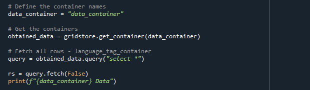

The next step would be to save the queried data into a dataframe to use
for analysis. We achieve this using pd.DataFrame() method to convert the
GridDB container lists to the data frame.

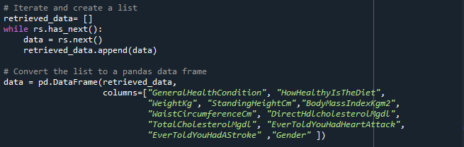

**Analysis and Visualization:**

Before starting the analysis, we will import some python libraries to
help us in our project:

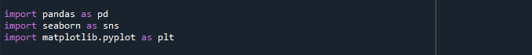

We will use a lambda method to apply the categorizeBMI function to our
data and divide it into four levels; ‘Underweight’, ‘Healthy Weight’,
‘Overweight’, and ‘Obesity’

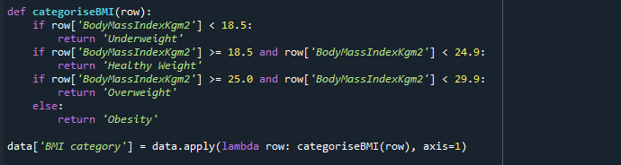

We would start by exploring the relationship between BMI and the gender
of the person, to get an idea of how BMI varies among males and females.

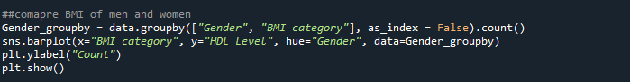

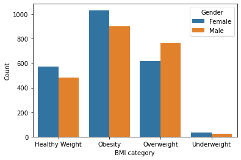

> Figure 1 : Male and Females with different BMI levels

As the graph shows, although men are more likely to be overweight than
women, women have higher chances of being obsessed.

One of our columns contains the HDL cholesterol level of the person.
Normal HDL levels are above 40 according to CDC, so we will use this
information to categorize the person into two categories; ‘Normal’ and
‘Dangerzone’.

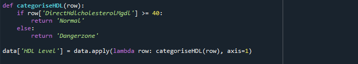

We will use HDL level and BMI category to divide the data into sections
and examine how the BMI level affects the HDL level of a person.

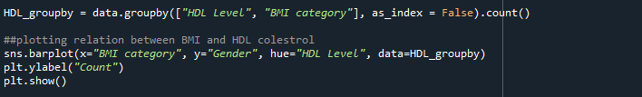

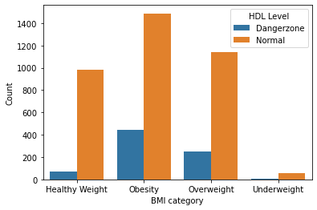

> Figure 2:BMI categories in relation with HDL levels

We can see that a person is more likely to be in the danger zone when
their BMI would be in the Obesity or Overweight range.

Similarly, we will use BMI levels to investigate their relationship with
the diet taken by the person.

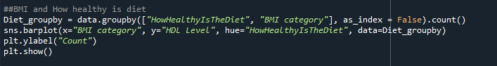

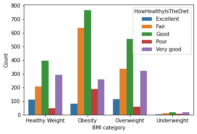

> Figure 3: Diet effect on BMI category

It is evident by looking into the above graph that the highest number of
people having poor or fair diet end up facing obesity, while most of the
people having excellent diet have a healthy weight.

Lastly, but most important factor to compare with BMI is the chances of
strokes or heart attack. For that, we will first filter out the people
who had stroke or heart attack individually and then explore their BMI
levels.

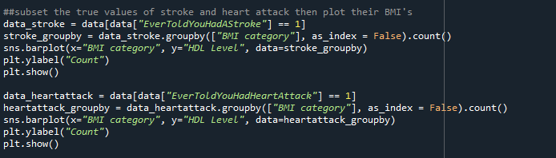

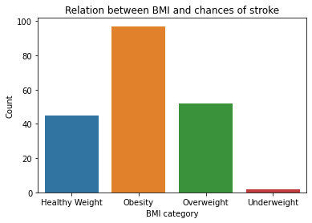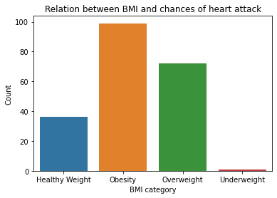

> Figure 4 & 5: Relationship between Stroke/Heart Attack and BMI

As expected, the graph verifies our common concern that people dealing
with obesity or overweight are more prone to having strokes or/and heart
attacks.

**Conclusion:**

NHANES survey data aided us to conclude that BMI should be an important
concern for people as it can be the reason for adverse health
conditions. Similarly, the diet of the person is a major contributor to
the BMI level of a person, and therefore, we should take care of our
diet to live a healthy life. All of the analysis was done using the
GridDB database at the backend, making the integration seamless and
efficient.
